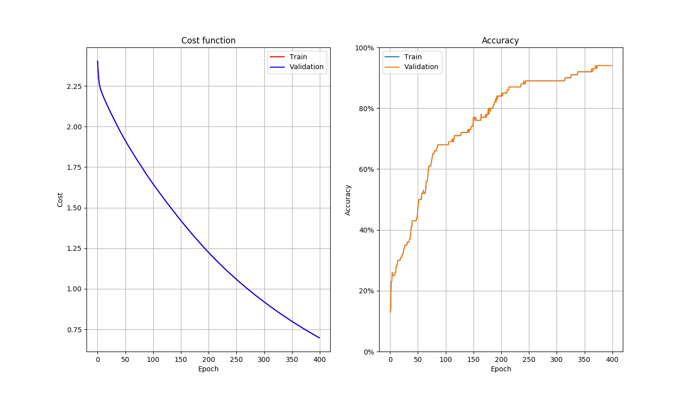
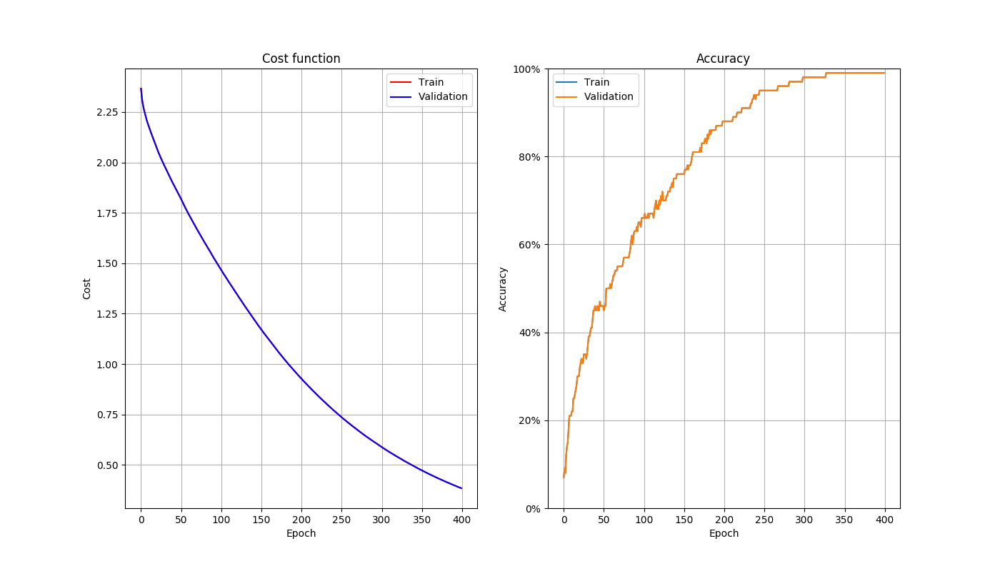
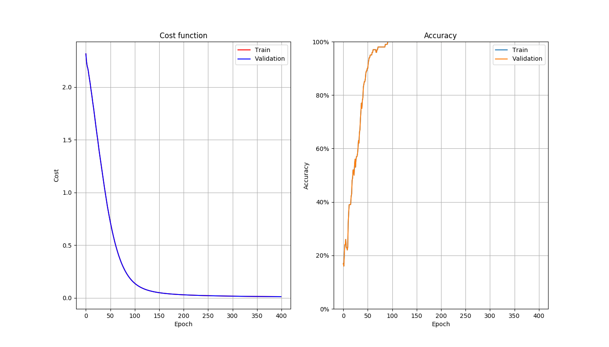
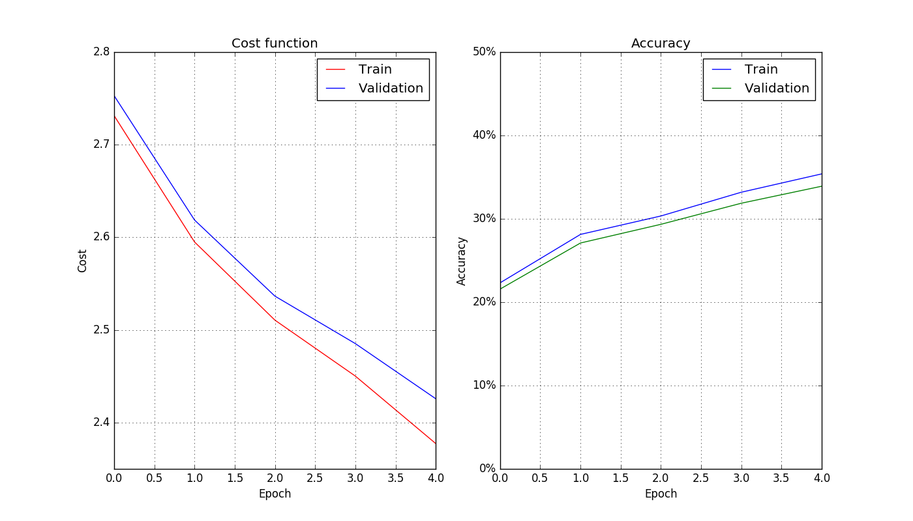
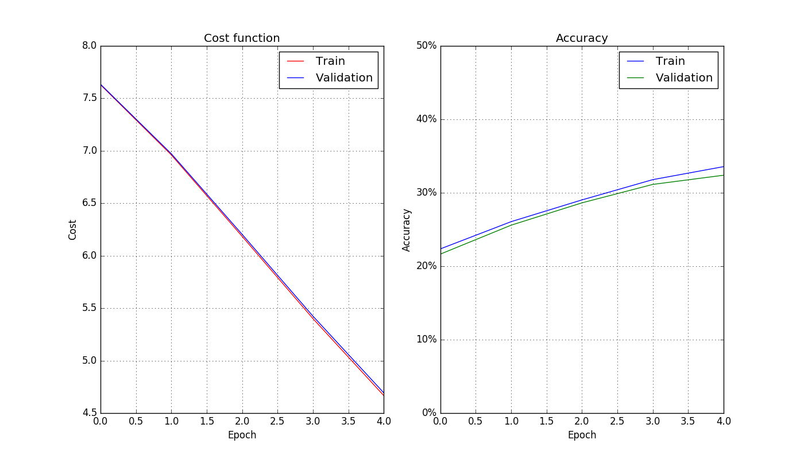
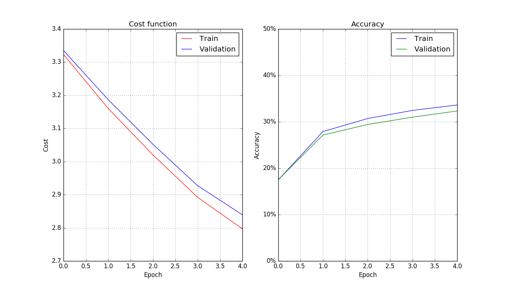
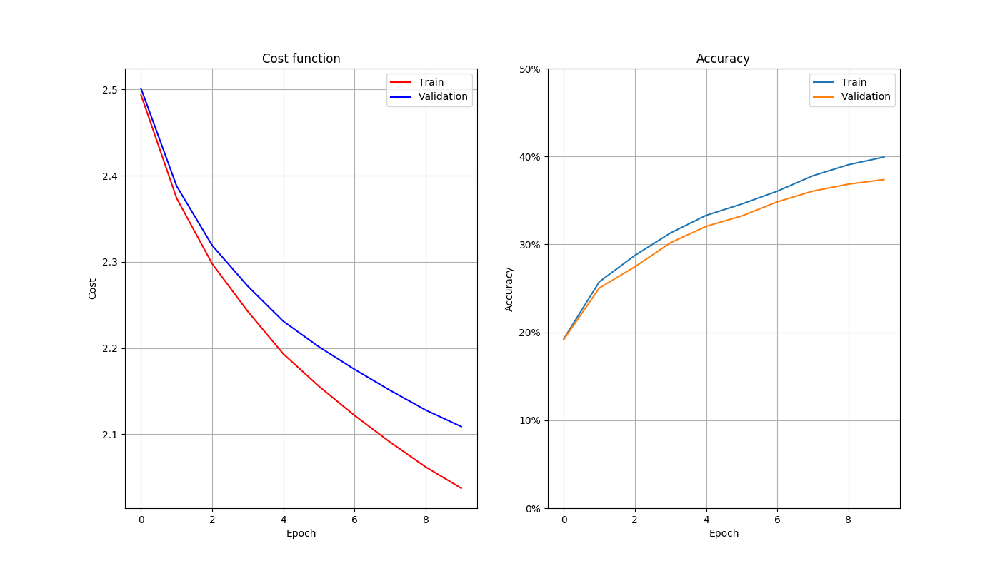
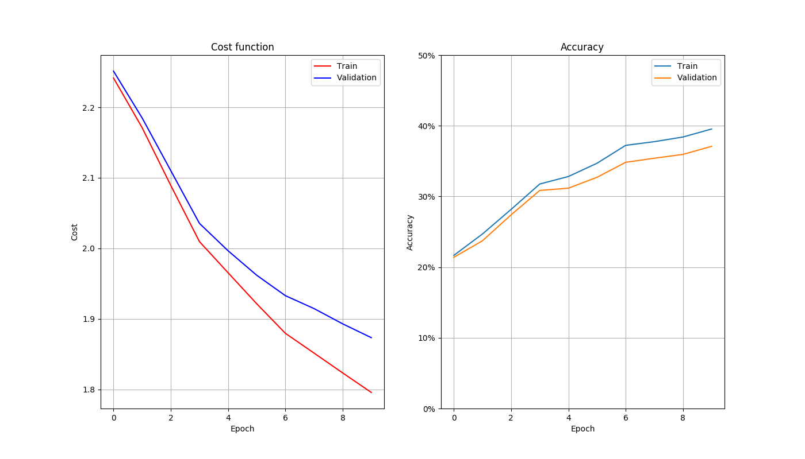
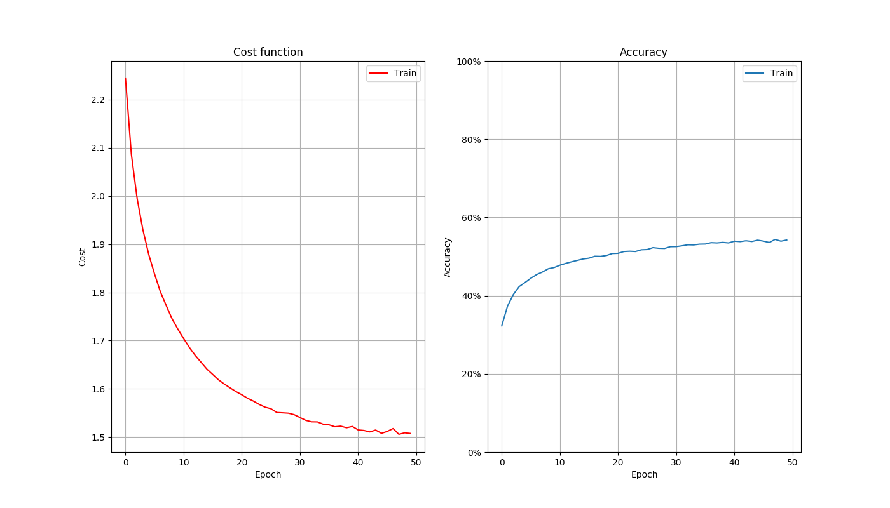
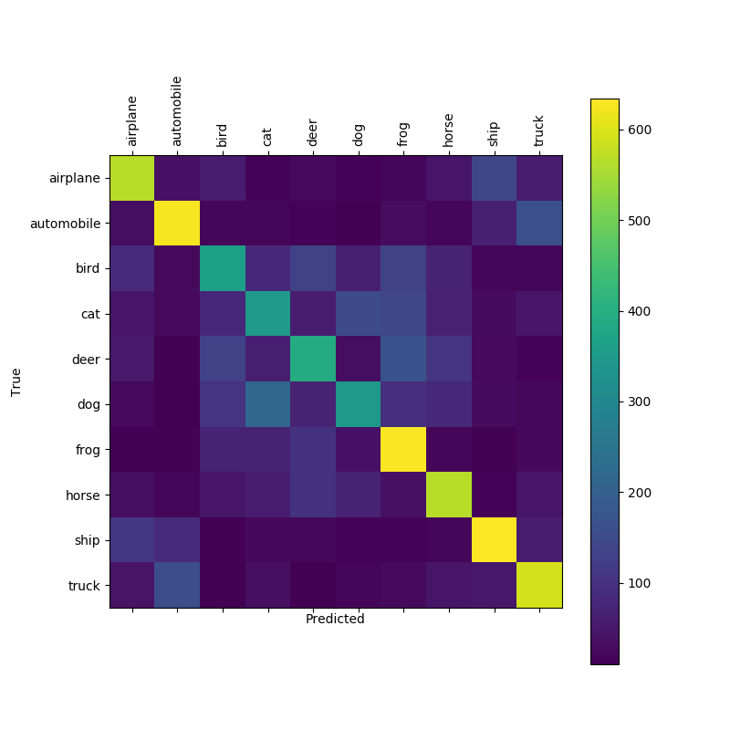

# Deep Learning in Data Science - Assignment 2
#### Two layer multi class classifier with ReLU activation, trained with SGD with momentum and L2 regularization

The overall goal of this second assignment is to implement a two layer network that performs classification on a multi class problem. We'll be using the CIFAR-10 image dataset. The network will be trained with stochastic mini-batch gradient descent with momentum, aiming at minimizing a loss function. The loss function used is the cross-entropy plus a regularization term.

## CIFAR-10 dataset

The Python version of the dataset is downloaded from [https://www.cs.toronto.edu/~kriz/cifar.html](https://www.cs.toronto.edu/~kriz/cifar.html).

The CIFAR-10 dataset consists of 60000 32x32 colour images in 10 classes, with 6000 images per class. There are 50000 training images and 10000 test images.

The dataset is divided into five training batches and one test batch, each with 10000 images. The test batch contains exactly 1000 randomly-selected images from each class. The training batches contain the remaining images in random order, but some training batches may contain more images from one class than another. Between them, the training batches contain exactly 5000 images from each class.

## Layer design and backpropagation

The network we will be using is composed by:
- "Batch Normalization" layer that simply subtracts mean of the training set to every input
- Fully connected layer with 50 output nodes
- ReLU activation layer
- Fully connected layer with 10 output nodes
- Softmax activation layer

These layers are modeled by the classes in the the file ```layers.py```. The general idea is that one layer will always have common properties (like a name, input size and output size) and methods (forward and backward pass), that are defined in the abstract class Layer.
Then the the specialized layers will only need to add their specific properties (e.g. regularization) and methods (e.g. backpropagation logic) and inherit the rest from Layer.

#### "Batch Normalization" layer
Given an input x, applies the function
```
out = Sigma (x - mu)
```

Used at the beginning of the network, the vector ```mu``` is set to be the mean of the training set and Sigma is simply an identity matrix. It is not a fully functioning batch normalization layer because the parameters ```mu``` and ```Sigma``` are not learned with gradient descent but fixed from the beginning.

#### Fully connected layer
Given an input x, applies the linear transformation
```
out = W x + b
```

The matrices ```W``` and ```b``` have sizes (output size x input size) and (output size x 1) resp.

During backpropagation this layer computes the gradients of matrices ```W``` and ```b``` to be used during the update step and pushes back the gradient to be used by the previous layers in the network.

Also, layers of this kind contribute to the cost function of the network if L2-regularization is used on the matrix ```W```.

#### ReLU activation layer
Given an input x, applies the function
```
out = max(0, x)
```

There is no trainable parameter in this step, so during the backward pass there is no gradient to compute and we only need to propagate back the gradient to the previous layer.

#### Softmax activation layer
Given an input x, applies the function
```
out = softmax(x)
```

Thanks to the properties of the softmax function, this output can be interpreted as class probabilities for a classification task. For this reason this layer is used at the end of our network.
During the backward pass the gradient for each sample is computed using the predicted class probabilities and its true label.

## Layer initialization
When it comes to initializing fully connected layers we can choose different strategies:
* zeros, typically used for the biases
* gaussian random values with zero mean and given variance, typically used for the weight matrices
* gaussian random values with zero mean and and variance that is a function of the output size (Xavier initialization), used to prevent the activations to "die" in deeper networks

These initializers and some small variations of them are implemented in the file ```initializers.py``` and can be passed to the constructor of a ```LinearLayer``` to initialize the weights and biases.

## Stacking layers to build a network
A network is simply and abstraction over a stack of layers that takes care of feeding the inputs and retrieving the outputs layer by layer, other than computing some higher level metrics such as cost and accuracy over a dataset. The logic to build a generic network layer by layer is found in ```network.py```. Moreover, inside ```utils.py``` we can find an helper function to build a network with the specific architecture for this assignment.

## Gradient checking
In order to be sure that the gradient computations are correct we can compare the results from backpropagation with the results of a numeric computation of the gradients.

A numeric method consists in computing a base value for the cost function, applying a small variation to a single weight value, recompute the cost and use it to estimate the derivative for that weight, then reset it and repeat the procedure for every weight in the network.

Once we've computed the gradients for every matrix in the network, both numerically and through backpropagation, we can compare the results.
The comparison is done by summing the absolute values of the difference between corresponding values in the matrices. Naively, the lower this sum the better. To double check, we can also compare the mean, the max and the min values of corresponding matrices.

The output of the tests contained in ```gradientchecking.py``` is the following.

#### One layer network with 0.2 regularization
**Weigh matrix**
```
- sum of abs differences: 7.833e-03
- mean of abs values   grad: 1.209e-01   grad_num: 1.209e-01
- min  of abs values   grad: 1.457e-06   grad_num: 1.251e-06
- max  of abs values   grad: 6.873e-01   grad_num: 6.873e-01
```
**Bias matrix**
```
- sum of abs differences: 5.684e-07
- mean of abs values   grad: 1.316e-01   grad_num: 1.316e-01
- min  of abs values   grad: 4.711e-02   grad_num: 4.711e-02
- max  of abs values   grad: 4.574e-01   grad_num: 4.574e-01
```

#### Two layer network with 0.1 and 0.3 regularization
**Weigh matrix 1**
```
- sum of abs differences: 2.344e-03
- mean of abs values   grad: 9.320e-02   grad_num: 9.320e-02
- min  of abs values   grad: 8.087e-07   grad_num: 7.390e-07
- max  of abs values   grad: 4.827e-01   grad_num: 4.827e-01
```
**Bias matrix 1**
```
- sum of abs differences: 2.457e-07
- mean of abs values   grad: 1.673e-01   grad_num: 1.673e-01
- min  of abs values   grad: 0.000e+00   grad_num: 0.000e+00
- max  of abs values   grad: 5.417e-01   grad_num: 5.417e-01
```
**Weigh matrix 2**
```
- sum of abs differences: 7.442e-05
- mean of abs values   grad: 5.806e-01   grad_num: 5.806e-01
- min  of abs values   grad: 5.705e-04   grad_num: 5.702e-04
- max  of abs values   grad: 8.951e+00   grad_num: 8.951e+00
```
**Bias matrix 2**
```
- sum of abs differences: 2.324e-07
- mean of abs values   grad: 1.697e-01   grad_num: 1.697e-01
- min  of abs values   grad: 1.754e-02   grad_num: 1.754e-02
- max  of abs values   grad: 8.484e-01   grad_num: 8.484e-01
```


## Optimization
The general optimization technique used in the assignment is Stochastic Gradient Descent.

All the optimizers described here are implemented in ```optimizers.py```. Note how the optimization logic is decoupled from the gradient computations that are a responsibility of each layer of the network. This allows us to test different optimizer without having to rewrite the backpropagation steps every time.

#### VanillaSGD
In its simplest version, the optimizer computes the activations of all the layers of a network in a forward pass. Then, it computes the gradients of the cost function with respect to every trainable parameter through backpropagation. Finally it updates these parameters subtracting a fraction of their gradients, so to approach a local minimum of the cost function.

In its simples version, the learning rate can be set to be fixed throughout training. Otherwise we can specify a decay factor that diminishes the learning rate at every epoch by setting. Typical values are close to 1 depending on the length of training.
```
learning rate <- decay factor * learning rate
```

#### MomentumSGD
Training with a vanilla gradient descent can be very slow. To overcome this issue and train the network faster we introduce the momentum update. The idea is to update the parameters of a network using not only the current gradient but also an weighted history of the previous updates. The weight given to past history is called *momentum*. A weight of 0 will result in a vanilla SGD, while higher values will give more importance to the gradients at previous steps.

**The effect of momentum**
Here we've tried to highlight the effect of momentum on the training curves. By taking a small subset of the data we are able to train for a high number of epochs and overfit on the training data. Increasing the momentum from 0.3 to 0.95 clearly improves the optimization speed.

* With momentum=0.3

  

* With momentum=0.6

  

* With momentum=0.8

  

* With momentum=0.95

  


## Search for parameters

In order to identify the best parameters for this network we iteratively explore the parameter space of learning rate and regularization weight. First we train a big number of networks with different combinations of the parameters taken from a wide range. Then we select the best performing networks and explore the parameter space near the values used for these networks. Finally, once identified a good combination of the parameters we let the network train for a longer number of epochs and test its performances against the test set.

The code for these tests is in ```parameter_search.py```, where the other hyper parameters are set to:
* hidden size 50
* decay_factor 0.998
* momentum 0.8

### Coarse Search
Tested the 49 combinations of the following values for regularization and learning rate:

```python
regularization = [0.001, 0.005, 0.01, 0.05, 0.1, 0.3, 0.5]
initial_learning_rate = [0.5, 0.3, 0.1, 0.05, 0.01, 0.005, 0.001]
```

The three networks that best perform on the validation set after 5 epochs are:



* Learning rate ```0.5```
* Regularization ```0.005```
* Train accuracy ```35.39%```
* Validation accuracy ```33.91%```



* Learning rate ```0.3```
* Regularization ```0.050```
* Train accuracy ```33.56%```
* Validation accuracy ```32.39%```



* Learning rate ```0.5```
* Regularization ```0.010```
* Train accuracy ```33.63%```
* Validation accuracy ```33.33%```

### Fine Search
Tested the 28 combinations of the following (generated) values for regularization and learning rate:

```python
regularization = np.linspace(0.005, 0.0005, num=7)
initial_learning_rate = np.linspace(0.35, 0.25, num=4)
```

The three networks that best perform on the validation set after 10 epochs are:



* Learning rate ```0.35```
* Regularization ```0.00275```
* Train accuracy ```39.93%```
* Validation accuracy ```37.37%```



* Learning rate ```0.35```
* Regularization ```0.0005```
* Train accuracy ```39.54%```
* Validation accuracy ```37.09%```


* Learning rate ```0.35```
* Regularization ```0.002```
* Train accuracy ```38.95%```
* Validation accuracy ```36.95%```

### Final
The final network is trained for 50 epochs, using a learning rate 0.35 of and a regularization of 0.00275.

The whole dataset is used for training, leaving out the final 10000 images for testing.

Here are the cost and accuracy plots for the final training.



After training, the network achieves:
* accuracy of **54.23%** on the training set
* accuracy of **50.67%** on the test set



*Confusion matrix on the test set*
