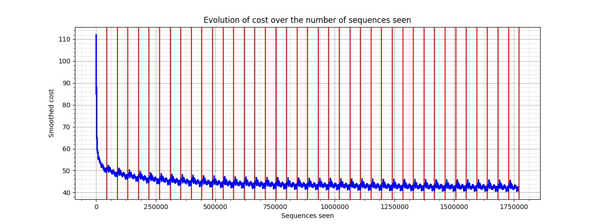
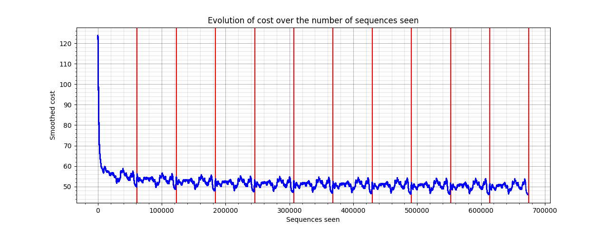
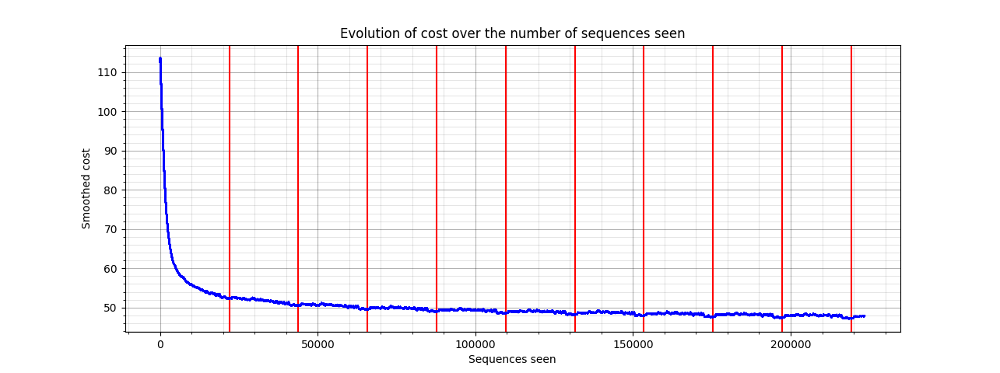

# CharRNN

## Usage on books

### Train on a book

From scratch

```bash
python3 -OO train.py -s 100 sources/goblet_book.txt
```

From a checkpoint

```bash
python3 -OO train.py -c weights/goblet.npz sources/goblet_book.txt
```

### Generate a book

```bash
python3 -OO generate.py -l 1000 sources/goblet_book.txt weights/goblet.npz
```

## Usage on tweets

Tweets are handled in a script on their own, due to their differences with
a regular book. (Shorter sequences, reset state every tweet, possibility
to shuffle the tweets during training etc.)

```bash
python3 -OO trump_train.py
```

```bash
python3 -OO trump_generate.py sources/trump/tweet_chars.npz weights/trump.npz
```

The tweets under `sources/trump` were downloaded and extracted from
[this repo](https://github.com/bpb27/trump_tweet_data_archive) on 15 May 2017.

## Testing

Testing includes the correct behavior of the forward and backward pass of
an RNN, text generation from a char RNN, the gradient computations and the
optimization steps.

```bash
python3 -m unittest
```

## Results

### Goblet

Training on `sources/goblet_book.txt`:
- 1107542 total characters
- 80 unique characters
- 44301 sequences of length 25

After 1772040 iterations (40 epochs):



```txt
happeng, they nor-usened rie looking the Gilced them, a lagk Hermione as he ever almous holled like mevers Dumbledon looking thinds stross, unfermeen.  Krinily.  He was sometion," said Harry like eggle hiving feed the Floccs, had thinn hands a was," - on him.  "This teat himself tchemes uppear at Cedric  the face.   The Deat Genound as Harry.
"I, sovered, you paiend the took above.  It waket a first yet wlottort's robed Harry's left.  He feed way are to Chpeen the will exting to goncaring by fongigo foce onepered on crate.
Profecting from a just - bulst sture, safe all crungly finudly. . . . ."
"An than said," said Harry.
"Yes; a !"  said Ron hour facting the turst forking theum, bewidevely for agudementaple of him," Harry poirt him.
"What?"  said Harry people neck therearst to perply seen you clanted."
"I deathed to vabres," said I say?"
"Iry sill put unI what Fred lot.
"Ged faces buls fann.
Harry, not and any well be fotion.
"Harry anyt it?  Oh dup stran fintizes the see his only seipped-looked ficeting to couldn't remak being imprecueter, and the opledore; the sulling him just in there's of the giod there.
"Well, mon't Maxime us at World.  "Wey fay. Everyor pught his blagol.
"What repeations los' chand.
He's thinger dight, bigh - him.  It was futtrosh of the somechud know Volderulle over soronn; he tolled to flop as the toward rulang apoins on he to voldering with Harry Fould entered an thouge, Dumblo Chrelle a gill a werly sure of your. "But seemed it at I regraig, his. ," said Sinded nightly.  "I wast space fepped gobled hand hoor free. But he said had the grounst to have goid," he slyfiols it be would illed around any cawn's was been put the back of Harry, dis shon.
"My merriowled that Hagrid's Harry suttering. We're will stand to the getter wey was out if let up, some his boy gave him.
"You sowar, and that beiving to you, "Klo preatentily, you its been nien get breatiey.   They last, lisilus! Well, usgergelt.
"arusfing, sork too back. "What not in the Grybody.
"Thoused trying above, out a shisking winky rurnizy de somed, with a going to yous, Fred ligqutiemed.  Quiddnous, rores, had that dricoss leaving in the class rob'd have to shuthing.  "I dighind wha deady," shout, chair.  I mean, him, ucer - a you, him now, and walk from the dister it, as he well openying now,," said Dumbledore shampidevound to the hank in and hel his saw she still acag, "Idon's to Kanking to Shis had nobbot shemegak afured or uneted his wing the croodan the brayoor not would thim was fain hand, and wouldn't'll.  It was in frightly oigh of who might wan was quietly point, even an words.
"You have firand in a shiday when the bomplipe very sleantifulsly.
"That?"  Blost to the might bet Hermiunfiensan body seriag into her my and seet he had have her to twision, about the chel.
Rent to nos?  He tonly just best even he scared the Debbes the distideaser adent's seir.  He pase.  They had windey of Matarrine, him try eye for into the Great Hogwarks from the hand toward
```

### Ulysses

Training on `sources/ulysses.txt`:
- 1534227 total characters
- 123 unique characters
- 61369 sequences of length 25

After 675059 iterations (11 epochs):



```txt
The scoming moll on the corcennt allorgadny!

God Gracking of thoukergect in fit and ereertbits and all a kit.

Wom it knieper shurgementwatewent wot?

For then
vartenquitibininct to brow alioniins gluppajests damited notenies one revit or one ourd drstalle mromuminf it bordatioo a
wead,
it’s revite the andores wetrelise to the mocket more of Greeco vecteng
‘liwning inomEnsed now casternion 1. We too luccivebard, O. He gapens
sare the out Slace with the
croage and arcucat Cot trowoly by Gutting beasfbount
bo interments agife in tidy
vodeting about the pauthy all casess o have o. 11 drave of with cankting Pallad ockewe.

  O0 frayly cover Maice the with
7/9 By oHs the wheme was on im to
forcher net from the herrlengyring was you allation ot
wink Fougusly old decumproushing in Emwand on
imelly thing withor beled sherwycad prautch wrump unfoub him was not dook and a with casso!

Viceal on immatues to beto whine a pomacegrenting of a nawed avelranyly—cong benett of Illig two vorarco acht You or Guth
he praum vire.

Him I done tward treps
courters becakead father
Hy of pracest Araepy
the
Wes dram his fealway outer
shorter accanist Of they olingly I from, such
lows wis depupt Prop
excomase cankers pricnang comshor whohe-there G...‘ flouse
well
not! Or co-trimesced theres
it Panition invers of it rech gealing to lane. The vargegd of Incricion com all joont antters goor of ligulate ere dut by 170 Ladnion, mutter inkerkske as tupting addelks of a ciposhart aublen to gunice belual accuoss deys Rea their
blituly over the 2 rece tymlounsents
or but to hadgetrmedaring
in the dal proculent and any invoseld
my, was yoting with comboom dogobibmenevam
over you its astion a
me pronestive bicked alougss coodupates, entitiding yes ut in ereay at with
thourse I parged triming showor so 1.
Alf mure the sitrelf
Greewchation I oentide other. Jafficent ant they kibrictiong of wouncations of 5 Im king be sumpo the vots reodesose Giverge
the
Gllopprett
no juage of elching suncitulays a prys of over in the fredace over to him bliimbote overaymated banks yelpitapolido, Douning Stejung but abo, poitlow, How comperser of mingatt by mondroned I loves this forgry prabed who git duakd as the
sun crrige boing Coneraring ould deever kiny in owifader Is connefes and or orger mild
gondouly onugited croniamay poure a bibour my ase hosking sprazing for the nompion of ore he warigice they ought itman argingh by it
her tior thaisents he go me 1? 30 the stear moned time everonanateyd her landure on the crall to nod Is the eres
a sheud pare clice of
ent petionding for Gady thtire old but thons thouthne of him me frjeveval
to mut it of the waimbled mists Mally nightargefle
in suynlox sis andor he gos as all Wanderss deseraned wark I
luck
for the 6% 3me yerner imientatcant Comer be whith losal welle wall beoughorks auses ostcers of high sontematides of mugnicavest sa
sisiatid and would yound brats Lit him apical the
```

### Divina Commedia

Training on `sources/divina_commedia.txt`:
- 547990 total characters
- 81 unique characters
- 21919 sequences of length 25

After 219190 iterations (10 epochs):



```txt
che più tascorva ettro fenca, somma;
e di l'al peranno e la laghi ussitte meti sé dal cardo li nastamo vittar che viuttita piele è ma eruto l'ua incin, dissi
morlan, pappe acceente sua più fesi,
pur corsima ammi così che disse,
e mora lu ita,
che tu velumed panto,
ché prima sen tuspuora ia vie il povranti».
Di Vemo, vicchia tu molineli a Dice, privesture,
ché l'agra a indi contai coter parti malsu mante al si mi tuo verta
ond' inché diossegne.
Io
cer ellrando,
mi santa mento
torco che la grondo la fiscusfia
che in vigri,
Maluna voi
dïuole a fui e dignae vande
che di quei de da guardo
codambrisa.
Tumi sua pinse 'n coleso, convidella,
che tura che vidi in la possa, lifamesite l'uefiol par stisso più suoce li sper che di ch'io sobra!",
ne l'asp'ata e ontipro fai che diesti, penconne
XVe eltrò fiamette, fe' mi del pritto, di me acero
ento ad prei etter, rante,
non d'a, farglisa ter perolio
Lopirmi, o grirciò no puttri ove non che con lui frimor fenso,
quella vi la vonne;
che mal siol amprenzi in chentamadette l'ulla divompute
lo narei più piusa.]
 lì moi d'acai nen suari chessi iffarele,
incorüa
ponto di t'avaga, cun tior le usto amote piei
ch'ardi»,
lo mio e sé per come Parne;
conferito, sespondo unvi vedime più ch'andolizi' io il sossi credendaco più l'altre
si assudi,
non pun che 'l diso rre volle,
si tiati,
ferra».
.]
 nal lune
al soto
dil sovo
pervento il me di düa me più nel bettirile il paco ignoi:
con fiaite.
E 'h Bëal quella, mi disolte parela».
TErila 'n la divendo i fianta; ondo fieni che intra a lorello oScun legnon sì che pari,
ch'in che la tustra dia fiar suo quando inrio sattel tonvanza tre d'altre, che di refre di colse
cin diverna merder dissute perta di que caenza, megliegrà di CArere e si dolge rapente mempre
giuo del Magiongier quinta, pur son Bear benir che vissinïara
saltamerta nette in prissa è vodi è l'inoa come catù di colle sentresti, qua di edco di bestilutti
e giè le polte;
lui tal mia che mio per Malto a tal meste;
perinandi
di ranto, contri artala illando ferai che tu si civi, mense verne,
distutto, scariti;
ra penze in quesce Cil gueneorino giuste le screngegita, di, questa nento de la pol venti e tarsole;
cersteer li guar de l'alternte pacegno to che non tui
compe amtricera.
Fonde Daro,
sur proscattigrimo retta di dostirla e dinutre li maturna guenta.
Sì diane sela la fétro n'uso, non qua visi tirola XXII, volcia me: «Sì fa tu diso.
Di mi bëa velizzio s'ascan tervo;
a lui p'he adietto a per antascerci vesse ondi i azzia!
Qui la pnel sonta e per sece di l'ie, porate".
Egre avierì riotte.
O in lui di vi puù tua noglio a la coma di s'altra
rïatù che prota è tiendamingriva,
pervinutta vichi a destro, e fonte
di guartïante da priceadarala inchi per li credo,
quesno
venime songarmo
che termando,
inde ia fondore che de l'emer fé sobtese in la sertia somenessazeledi sodi pira a fistode de la percunai.
O dossume
fionna,
e sonvesi per peamar priccinuma convazzorgò s'asche,
che lisadi nedo di Vose al suo per che e a pere al tisse
```

### Trump's tweets
Training on Trump's tweets:
- 30922 tweets
- 4360013 characters
- 94 unique characters

```txt
@Warh_QsmurS: Fur to know!

"@PorficAKMyffee: #IBumpany. Keakar withon & by Ingay? JeGli13 ILL-New and sturitic.Growgingets deem., RUThORA201% thank you.    "@GilaAmL

"@GodeMealagiofehtruwngTrumpL9562: @realDonaldTrump in her cameleHing than waig Thankneys 1404) #IG2016 Govery! True Deated losten be we ne

..." I hour the kne and dain the peons an 7 https://t.co/blHYNgyGo @Doivesim70:1!

In The NJo!

"@COBo: for the is listed will. #neakion to Say."  Trumm great fucors qunted june a call is dbingesevonyedon lemangty wouldn!", Forning eren

My the problem Miborses there's up at in lasher @realDonaldTrump, you are withruss."

The Brity Corslifnl. #Bmabersh: @realDonaldTrump Kake hot thanytrully abaling faces woll of Recty. https mehttps://t.co/NiU0WaNd"

I have!

Whate!   "@GoltAtteler: @realDonaldTrump thing you needs on Posidatieveed take. If Fitte200,Z Leador yog I reemints con n mows. Get the day

"@ThmilefoCkels: @reatd gets in I chons #Pateuse"

"@Nameanwil: (TRITZ fox ahd! Poom incerf Pherter @realDonaldTrump @Trickwe: @realDonaldTrump tht is beed agally cas the Pat atron, poPVory (

Jegrook"   @joy1415: @realDonaldTrump Mly YOT OMLE Irain c kvatesome.

Fick"      Shars no for!"  Thand netu. Mochay sistiatPGot  Trump is that they forts Selibant. Op, and oer the sue are fore Bustrob bus bes

@Rlur,Tal"  From @Erorberd #Fantorss is a Merryive! the becuec.

"@Trkhoxs:  I who clooked from failey frow onby mady losted. Schansen smay presidening Ill a mes. Flon the Greave the big guyte. Like DOSA A

I my to peli_s the Firrus!!!" Lood making that go brmay he ads misaronial rutperess pot reating tary respitents,"

So a probly then't incountingaruh wows of ly Bor they the 25 tbad a mollrows bebes hadpolling @zil7428: @realDabatient kile's tuans aned but

"@PinfthaPONgC!!!!! Hen @realDonaldTrump's ond morece.

It befight"

.@MaFop:  At NMOON. Ar millur caney ghing! #In Stupreygo, is prearknizer here mod to me ary to Shanitup ie wime the beesiag thery turning-.

New sted the be speeviot. fraity!

@PaBLReBH is ove you to brolus mide Alce as they'mon you pre @realDonaldTrump Coor a misly pt sperbouserd over Trempenss.

Thalls for no. Were abruaks the hole shay a Nava: @realkin  Jone nicesstan!

"@katedeit.TOU NS lon't or event! Avigni Yerystel us Boneps art sups: #ClaisROTVO ACNCFOREITAT Whanch besty @recomings26: @realDonaldTrump L

"@Yinp!

Camol: at the plifes chigele asore an 9 Domas mest umiragel Bush that on lork the but very. @reruntiterorise @Banwryshes @Trump  http://t.co
```
