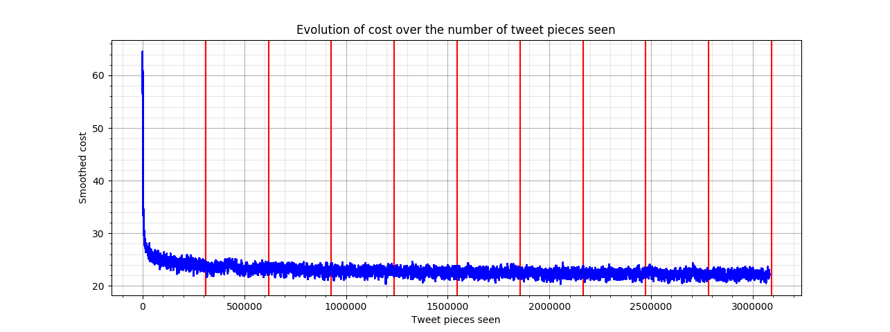

# Trump's tweets

Handling tweets is conceptually close to handling sequences from book sources, with a few key differences that need to be addressed both in the text preparation and during training. The adapted code is in [trump_train.py](trump_train.py) and [trump_generate.py](trump_generate.py).

## Preparation
Here are the operations executed on the tweets to prepare them for training.

1. The tweets are loaded from JSON format and every information except their text content is stripped away
2. All non-ascii characters such as Emoji are removed
3. All newline characters are turned into spaces
4. All the html-encoded symbols like are replaced with their ascii value (e.g. `&gt;` becomes `>`)
5. Sequences shorter than 140 characters are padded with spaces
6. The start of a tweet is marked by the null character '\0' and is fed into the network together with a null state.

So a tweet as such:
```
Happy new year!

Cheers &lt;3
```

would become this pair of input-target sequences, each one 140 characters long:

|          |0 |1|2|3| | | | | | | | | | | | | | | | | | | | | | | | |   |139|
|----------|--|-|-|-|-|-|-|-|-|-|-|-|-|-|-|-|-|-|-|-|-|-|-|-|-|-|-|-|---|---|
|**Input** |\0|H|a|p|p|y| |n|e|w| |y|e|a|r|!| |C|h|e|e|r|s| |<|3| | |...|   |
|**Target**|H |a|p|p|y| |n|e|w| |y|e|a|r|!| |C|h|e|e|r|s| |<|3| | | |...|   |

Having a _start-of-tweet_ character means that the network will always have to make a guess on the first character (maybe based on the most frequent characters), but at the same time it simplifies the generation process as detailed below.

## Training

The 140 charatchers long sequences are split in chunks of 14. For each tweet, the optimizing process will feed the network these 10 subsequences in order, without resetting the last state outputted. On the contrary, the state will be set back to zero at the beginning of every new tweet.

With this procedure it is possible to shuffle the order of the tweets when feeding them to the network, as a consequence we avoid the periodical fluctuations that used to happen when training along one epoch. Compare the previous loss plots with this one (10 epochs):



During training it is possible to notice how the network easily picked up some typical traits of Twitter such as `@MentioningSomeone`, `#hashtagsEverywhere` and `sho.rt/url/s`. On the other hand, building phrases that make sense out of context is a much harder task, due to the nature of the tweets.

Here are some highlights from training:

* Completed epochs 2 tweets 18000/30922 cost 20.97 elapsed 2913s:
  > @Warh_QsmurS: Fur to know!

* Completed epochs 0 tweets 26000/30922 cost 23.74 elapsed 922s:
  > "@PorficAKMyffee: #IBumpany. Keakar withon & by Ingay? JeGli13 ILL-New and sturitic.Growgingets deem., RUThORA201% thank you.    "@GilaAmL

* Completed epochs 0 tweets 30000/30922 cost 24.05 elapsed 1065s:
  > "@GodeMealagiofehtruwngTrumpL9562: @realDonaldTrump in her cameleHing than waig Thankneys 1404) #IG2016 Govery! True Deated losten be we ne

* Completed epochs 1 tweets 24000/30922 cost 22.86 elapsed 1967s:
> Obama arsout commen-!

* Completed epochs 1 tweets 26000/30922 cost 23.45 elapsed 2039s:
> "@MaAvisilEVTh Bires, a great great work! Wales re f-Fordecm.   "     Ricgettrath afould!

* Completed epochs 2 tweets 6000/30922 cost 22.20 elapsed 2441s:
  > ..." I hour the kne and dain the peons an 7 https://t.co/blHYNgyGo @Doivesim70:1!

* Completed epochs 3 tweets 2000/30922 cost 23.05 elapsed 3448s:
  > In The NJo!

* Completed epochs 3 tweets 4000/30922 cost 22.71 elapsed 3523s:
  > "@COBo: for the is listed will. #neakion to Say."  Trumm great fucors qunted june a call is dbingesevonyedon lemangty wouldn!", Forning eren

* Completed epochs 3 tweets 18000/30922 cost 22.58 elapsed 4059s:
  > My the problem Miborses there's up at in lasher @realDonaldTrump, you are withruss."

* Completed epochs 4 tweets 22000/30922 cost 22.96 elapsed 5441s:
  > The Brity Corslifnl. #Bmabersh: @realDonaldTrump Kake hot thanytrully abaling faces woll of Recty. https mehttps://t.co/NiU0WaNd"

* Completed epochs 9 tweets 2000/30922 cost 22.43 elapsed 11691s:
  > I have!

## Generation

After the training is complete and the weights saved it is possible to generate as many tweets as desired. This time there is no need to _warm up_ the state of the RNN and it is enough to feed a '\0' character and a null state to unleash the tweeting machine.

> Whate!   "@GoltAtteler: @realDonaldTrump thing you needs on Posidatieveed take. If Fitte200,Z Leador yog I reemints con n mows. Get the day

> "@ThmilefoCkels: @reatd gets in I chons #Pateuse"

> "@Nameanwil: (TRITZ fox ahd! Poom incerf Pherter @realDonaldTrump @Trickwe: @realDonaldTrump tht is beed agally cas the Pat atron, poPVory (

> Jegrook"   @joy1415: @realDonaldTrump Mly YOT OMLE Irain c kvatesome.

> Fick"      Shars no for!"  Thand netu. Mochay sistiatPGot  Trump is that they forts Selibant. Op, and oer the sue are fore Bustrob bus bes

> @Rlur,Tal"  From @Erorberd #Fantorss is a Merryive! the becuec.

> "@Trkhoxs:  I who clooked from failey frow onby mady losted. Schansen smay presidening Ill a mes. Flon the Greave the big guyte. Like DOSA A

> I my to peli_s the Firrus!!!" Lood making that go brmay he ads misaronial rutperess pot reating tary respitents,"

> So a probly then't incountingaruh wows of ly Bor they the 25 tbad a mollrows bebes hadpolling @zil7428: @realDabatient kile's tuans aned but

> "@PinfthaPONgC!!!!! Hen @realDonaldTrump's ond morece.

> It befight"

> .@MaFop:  At NMOON. Ar millur caney ghing! #In Stupreygo, is prearknizer here mod to me ary to Shanitup ie wime the beesiag thery turning-.

> New sted the be speeviot. fraity!

> @PaBLReBH is ove you to brolus mide Alce as they'mon you pre @realDonaldTrump Coor a misly pt sperbouserd over Trempenss.

> Thalls for no. Were abruaks the hole shay a Nava: @realkin  Jone nicesstan!

> "@katedeit.TOU NS lon't or event! Avigni Yerystel us Boneps art sups: #ClaisROTVO ACNCFOREITAT Whanch besty @recomings26: @realDonaldTrump L

> "@Yinp!

> Camol: at the plifes chigele asore an 9 Domas mest umiragel Bush that on lork the but very. @reruntiterorise @Banwryshes @Trump  http://t.co
